# TTD-DR Phase 1 MVP 完全運用マニュアル
## Test-Driven Development for Research システム使用ガイド

*最終更新日: 2025-08-12*  
*バージョン: Phase 1 MVP*

---

## 📋 目次

1. [システム概要](#システム概要)
2. [インストールと初期設定](#インストールと初期設定)
3. [基本的な使い方](#基本的な使い方)
4. [詳細運用方法](#詳細運用方法)
5. [高度な活用法](#高度な活用法)
6. [トラブルシューティング](#トラブルシューティング)
7. [最適化とメンテナンス](#最適化とメンテナンス)
8. [実用例とユースケース](#実用例とユースケース)

---

## 🎯 システム概要 {#システム概要}

### TTD-DRとは
**TTD-DR (Test-Driven Development for Research)** は、研究・調査プロセスを自動化・最適化する4エージェント統合システムです。

### 4つの核心エージェント

```mermaid
graph LR
    A[Research Planner<br>研究計画] --> B[Iterative Researcher<br>反復研究]
    B --> C[Self-Evolution<br>自己進化]
    C --> D[Final Integrator<br>最終統合]
    D --> E[高品質研究レポート]
```



**1. Research Planner Agent (研究計画エージェント)**
- 📋 研究クエリの分析・分類
- 🎯 最適な研究戦略の立案
- 📊 リソース配分計画

**2. Iterative Researcher Agent (反復研究エージェント)**
- 🔍 効率的な情報収集
- 📈 品質評価による反復改善
- 🎯 関連性の高い情報抽出

**3. Self-Evolution Agent (自己進化エージェント)**
- 🧬 複数視点からの内容生成
- ⭐ AI審査による品質評価
- 🔄 継続的な品質向上

**4. Final Integrator Agent (最終統合エージェント)**
- 📝 一貫性のある最終レポート生成
- 🔍 品質検証と最適化
- 📊 包括的な出力フォーマット

### システムの特徴
✅ **完全自動化**: ワンコマンドで高品質レポート生成  
✅ **品質保証**: 多段階品質チェックシステム  
✅ **柔軟な設定**: カスタマイズ可能なパラメータ  
✅ **実運用対応**: エラーハンドリング・モニタリング完備  
✅ **日本語対応**: 日本語研究クエリに最適化  

---

## ⚙️ インストールと初期設定 {#インストールと初期設定}

### 1. システム要件

**必須要件:**
- Python 3.8以上
- 2GB以上のメモリ
- 1GB以上のストレージ空き容量

**推奨要件:**
- Python 3.10以上
- 4GB以上のメモリ
- インターネット接続

### 2. ファイル構成確認

TTD-DRシステムファイルが以下のように配置されていることを確認してください：

```
TTD-DR/
├── research_planner_agent.py          # 研究計画エージェント
├── iterative_researcher_agent.py      # 反復研究エージェント（※未記載の場合は作成）
├── self_evolution_agent.py            # 自己進化エージェント
├── final_integrator_agent.py          # 最終統合エージェント
├── ttd_dr_system_integration.py       # システム統合フレームワーク
├── ttd_dr_error_handling.py           # エラーハンドリング
├── ttd_dr_performance_optimization.py # パフォーマンス最適化
├── ttd_dr_monitoring_logging.py       # 監視・ログシステム
├── run_ttd_dr.py                      # 対話型実行スクリプト
├── quick_research.py                  # クイック実行スクリプト
└── ttd_dr_output/                     # 出力ディレクトリ
```

### 3. 依存関係インストール

```bash
# 基本的な依存関係
pip install requests

# オプション（より高機能な環境の場合）
pip install psutil  # パフォーマンス監視（Termuxでは不要）
```

### 4. 実行権限付与

```bash
chmod +x run_ttd_dr.py
chmod +x quick_research.py
```

### 5. 出力ディレクトリ作成

```bash
mkdir -p ttd_dr_output
```

---

## 🚀 基本的な使い方 {#基本的な使い方}

### 方法1: クイック実行（推奨初回使用）

**1行コマンドで即座に研究レポート生成**

```bash
python quick_research.py "あなたの研究テーマ"
```

**実行例:**
```bash
python quick_research.py "機械学習の最新動向について調査"
python quick_research.py "リモートワークの効果的な運営方法"
python quick_research.py "持続可能な都市開発の事例研究"
```

**出力例:**
```
🔍 研究クエリ: 機械学習の最新動向について調査
🚀 TTD-DR実行中...
✅ 研究完了!
📄 TTD-DR Research Report
📊 品質スコア: 4.2/5.0
📝 文字数: 3500
🆔 実行ID: ttd_dr_1754990500
💾 結果: ttd_dr_output/ttd_dr_1754990500_report.md
```

### 方法2: 対話型実行（詳細カスタマイズ）

**詳細設定を行いながら研究レポート生成**

```bash
python run_ttd_dr.py
```

**実行フロー:**
```
🎯 TTD-DR Phase 1 MVP - 研究レポート生成システム
============================================================

📝 研究したいテーマを入力してください：
> 深層学習における転移学習の活用方法

🔍 研究テーマ: 深層学習における転移学習の活用方法

⚙️  詳細設定 (Enterで標準設定):
目標文字数 [3000]: 5000
最大セクション数 [6]: 8
検索反復回数 [10]: 15
進化反復回数 [5]: 7

📊 設定:
  目標文字数: 5000
  最大セクション数: 8
  検索反復回数: 15
  進化反復回数: 7

🚀 TTD-DRシステム初期化中...
🔬 研究開始... (このプロセスには時間がかかる場合があります)
```

---

## 📊 詳細運用方法 {#詳細運用方法}

### 1. 研究クエリの効果的な書き方

#### ✅ 良い研究クエリの例
```
❤️  具体的で範囲が明確
"機械学習における画像認識技術の産業応用事例と課題分析"

❤️  目的が明確
"中小企業のデジタル変革を成功させる具体的戦略とロードマップ"

❤️  分析観点が含まれる
"リモートワーク環境における生産性向上方法の比較分析"
```

#### ❌ 改善が必要な研究クエリの例
```
❌ 漠然としている
"AIについて" → "AI技術の特定分野での活用方法について"

❌ 範囲が広すぎる
"経営戦略すべて" → "中小企業におけるデジタル化戦略について"

❌ 質問形式のみ
"なぜAIが重要？" → "AI技術が現代ビジネスに与える影響と重要性分析"
```

### 2. パラメータ設定ガイド

#### 文字数設定の目安
```
📄 簡単な概要レポート:     1,500 - 2,500文字
📄 標準的な調査レポート:   3,000 - 5,000文字
📄 詳細な研究レポート:     5,000 - 8,000文字
📄 包括的な分析レポート:   8,000 - 12,000文字
```

#### セクション数の目安
```
📚 基本構成:      3-4セクション (概要、詳細、結論)
📚 標準構成:      5-6セクション (導入、現状分析、事例、課題、提案、結論)
📚 詳細構成:      7-8セクション (背景、理論、手法、事例、比較、課題、提案、結論)
📚 包括的構成:    9-10セクション (完全な学術的構成)
```

#### 反復回数の設定
```
⚡ 高速実行:      検索3-5回、進化2-3回 (1-2分)
⚙️  標準実行:      検索8-12回、進化5-7回 (5-10分)
🔍 高品質実行:    検索15-20回、進化8-10回 (15-30分)
🏆 最高品質実行:  検索25-30回、進化12-15回 (30-60分)
```

### 3. 出力ファイルの理解

TTD-DRシステムは以下のファイルを生成します：

#### メインファイル
```
📁 ttd_dr_output/
├── {実行ID}_report.md          # 📖 最終研究レポート（メイン成果物）
├── {実行ID}_output.json        # 📊 詳細データ・品質メトリクス
└── {実行ID}_execution.json     # 🔧 実行ログ・システム情報
```

#### ファイル内容詳細

**📖 `_report.md` (最終研究レポート)**
- 人間が読みやすい形式の完成レポート
- マークダウン形式で整理された構造
- 即座に使用可能な研究成果

**📊 `_output.json` (詳細データ)**
```json
{
  "research_report": {
    "title": "研究レポートタイトル",
    "content": "レポート本文",
    "word_count": 3500,
    "sections": 6,
    "citations": 15
  },
  "quality_metrics": {
    "overall_quality": 4.2,
    "completeness_score": 0.92,
    "consistency_score": 0.88,
    "coherence_score": 0.90
  },
  "execution_summary": {
    "total_search_results": 45,
    "evolution_iterations": 5,
    "final_word_count": 3500
  }
}
```

**🔧 `_execution.json` (実行ログ)**
- システム実行の詳細情報
- パフォーマンスメトリクス
- エラー情報（発生時）

### 4. 品質スコアの読み方

TTD-DRシステムは多次元品質評価を行います：

#### 総合品質スコア（5.0点満点）
```
🏆 4.5-5.0点: 最高品質（学術論文レベル）
⭐ 4.0-4.4点: 高品質（実務使用可能）
✅ 3.5-3.9点: 良好（基本的な調査として適切）
⚠️  3.0-3.4点: 標準（改善余地あり）
❌ 3.0点未満: 要改善（再実行推奨）
```

#### 詳細品質メトリクス
```
📊 Completeness Score (完全性): 情報の網羅性
📊 Consistency Score (一貫性): 論理的整合性
📊 Coherence Score (論理性): 文章の流れ・構造
📊 Citation Quality (引用品質): 参考資料の適切性
```

---

## 🎓 高度な活用法 {#高度な活用法}

### 1. カスタム設定ファイルの作成

より細かい制御のために設定ファイルを作成：

```python
# custom_config.py
from ttd_dr_system_integration import SystemConfiguration

def create_custom_config():
    config = SystemConfiguration(
        planner_config={
            'target_length': 8000,
            'max_sections': 10,
            'research_depth': 'comprehensive',
            'analysis_focus': ['technical', 'practical', 'strategic']
        },
        researcher_config={
            'search_iterations': 20,
            'min_quality_threshold': 4.0,
            'max_results_per_query': 15,
            'diversification_factor': 0.8
        },
        evolution_config={
            'max_iterations': 10,
            'convergence_threshold': 4.5,
            'variant_count': 5,
            'evaluation_criteria': ['accuracy', 'completeness', 'clarity']
        },
        integrator_config={
            'consistency_weight': 0.4,
            'coverage_weight': 0.3,
            'quality_weight': 0.3,
            'citation_style': 'academic'
        }
    )
    return config
```

### 2. バッチ処理スクリプト

複数の研究クエリを一括処理：

```python
# batch_research.py
import sys
from ttd_dr_system_integration import TTDDRSystemIntegrator
from custom_config import create_custom_config

def batch_research():
    queries = [
        "人工知能技術の最新動向と産業応用",
        "サステナビリティ経営の実践方法",
        "デジタルトランスフォーメーションの成功要因"
    ]
    
    config = create_custom_config()
    system = TTDDRSystemIntegrator(config)
    
    results = []
    for i, query in enumerate(queries, 1):
        print(f"📊 処理中 {i}/{len(queries)}: {query}")
        
        result = system.execute_research_pipeline(
            user_query=query,
            constraints={'target_length': 5000, 'max_sections': 7}
        )
        
        results.append({
            'query': query,
            'success': result['status'] == 'success',
            'execution_id': result.get('execution_id'),
            'quality': result.get('quality_metrics', {}).get('overall_quality', 0)
        })
        
        print(f"✅ 完了: 品質スコア {result.get('quality_metrics', {}).get('overall_quality', 0):.2f}")
    
    # サマリー出力
    print("\n📋 バッチ処理結果サマリー:")
    for result in results:
        status = "✅" if result['success'] else "❌"
        print(f"{status} {result['query'][:50]}... (品質: {result['quality']:.2f})")

if __name__ == "__main__":
    batch_research()
```

### 3. APIサーバー化

TTD-DRをWebAPIとして提供：

```python
# api_server.py
from flask import Flask, request, jsonify
from ttd_dr_system_integration import TTDDRSystemIntegrator, create_default_configuration

app = Flask(__name__)

@app.route('/api/research', methods=['POST'])
def research_endpoint():
    try:
        data = request.json
        query = data.get('query', '')
        
        if not query:
            return jsonify({'error': 'Query is required'}), 400
            
        # TTD-DR実行
        config = create_default_configuration()
        system = TTDDRSystemIntegrator(config)
        
        result = system.execute_research_pipeline(
            user_query=query,
            constraints=data.get('constraints', {})
        )
        
        return jsonify({
            'status': result['status'],
            'execution_id': result.get('execution_id'),
            'quality_score': result.get('quality_metrics', {}).get('overall_quality', 0),
            'report_content': result.get('final_output', {}).get('research_report', {}).get('content', ''),
            'word_count': result.get('final_output', {}).get('research_report', {}).get('word_count', 0)
        })
        
    except Exception as e:
        return jsonify({'error': str(e)}), 500

if __name__ == '__main__':
    app.run(host='0.0.0.0', port=5000, debug=False)
```

### 4. スケジュール実行

定期的な研究レポート生成：

```python
# scheduler.py
import schedule
import time
from datetime import datetime
from ttd_dr_system_integration import TTDDRSystemIntegrator, create_default_configuration

def daily_research():
    """毎日のトレンド調査"""
    queries = [
        f"{datetime.now().strftime('%Y-%m-%d')} 技術ニュース要約",
        f"{datetime.now().strftime('%Y-%m-%d')} 市場動向分析"
    ]
    
    config = create_default_configuration()
    system = TTDDRSystemIntegrator(config)
    
    for query in queries:
        print(f"🔄 定期実行: {query}")
        result = system.execute_research_pipeline(
            user_query=query,
            constraints={'target_length': 2000, 'max_sections': 4}
        )
        print(f"✅ 完了: {result.get('execution_id')}")

# スケジュール設定
schedule.every().day.at("09:00").do(daily_research)

print("📅 スケジューラー開始...")
while True:
    schedule.run_pending()
    time.sleep(60)
```

---

## 🔧 トラブルシューティング {#トラブルシューティング}

### よくある問題と解決方法

#### 1. 実行エラー

**問題**: `ModuleNotFoundError: No module named 'ttd_dr_system_integration'`
```bash
# 解決方法
cd /path/to/ttd_dr_directory
python -c "import ttd_dr_system_integration; print('OK')"
```

**問題**: `JSON serializable error`
```bash
# 既に修正済みですが、古いバージョンの場合
git pull origin from-oppo  # 最新版を取得
```

#### 2. パフォーマンス問題

**問題**: 実行が遅い
```python
# 高速設定の使用
python quick_research.py "クエリ"  # 最も高速

# または設定を軽量化
config.researcher_config['search_iterations'] = 3
config.evolution_config['max_iterations'] = 2
```

**問題**: メモリ不足
```python
# メモリ使用量を削減
config.planner_config['target_length'] = 2000  # 文字数削減
config.researcher_config['max_results_per_query'] = 5  # 結果数制限
```

#### 3. 出力品質問題

**問題**: 品質スコアが低い
```python
# 品質向上設定
config.researcher_config['search_iterations'] = 15  # 検索回数増加
config.evolution_config['max_iterations'] = 8       # 進化回数増加
config.researcher_config['min_quality_threshold'] = 4.0  # 品質基準上昇
```

**問題**: 内容が浅い
```python
# より深い分析のための設定
config.planner_config['target_length'] = 5000      # 文字数増加
config.planner_config['max_sections'] = 8          # セクション数増加
config.researcher_config['search_iterations'] = 20 # 徹底的な調査
```

### 4. デバッグ方法

#### ログ確認
```python
# 詳細ログの有効化
import logging
logging.basicConfig(level=logging.DEBUG)

# ログファイルの確認
tail -f ttd_dr_output/system.log
```

#### 実行状況の監視
```python
# 実行中の詳細情報表示
python -c "
import logging
logging.basicConfig(level=logging.INFO)
exec(open('quick_research.py').read())
"
```

---

## ⚡ 最適化とメンテナンス {#最適化とメンテナンス}

### 1. パフォーマンス最適化

#### システムリソース監視
```bash
# 実行中のリソース使用量確認
htop  # または top

# ディスク使用量確認
du -sh ttd_dr_output/
```

#### キャッシュ最適化
```python
# 定期的なキャッシュクリア
import os
import glob

def cleanup_cache():
    cache_files = glob.glob("ttd_dr_output/*_execution.json")
    old_files = [f for f in cache_files if os.path.getmtime(f) < time.time() - 7*24*3600]  # 7日以上前
    
    for file in old_files:
        os.remove(file)
        print(f"🗑️  削除: {file}")

cleanup_cache()
```

### 2. 定期メンテナンス

#### 週次メンテナンス（5分）
```bash
#!/bin/bash
# weekly_maintenance.sh

echo "🔧 TTD-DR 週次メンテナンス開始"

# 古いログファイルの削除
find ttd_dr_output/ -name "*.log" -mtime +30 -delete

# 古い実行結果の圧縮
find ttd_dr_output/ -name "*_execution.json" -mtime +7 -exec gzip {} \;

# ディスク使用量レポート
echo "📊 ディスク使用量:"
du -sh ttd_dr_output/

echo "✅ メンテナンス完了"
```

#### 月次レビュー（15分）
```python
# monthly_review.py
import json
import glob
from collections import defaultdict
from datetime import datetime, timedelta

def monthly_performance_review():
    """月次パフォーマンスレビュー"""
    
    # 過去1ヶ月のファイルを取得
    one_month_ago = datetime.now() - timedelta(days=30)
    output_files = glob.glob("ttd_dr_output/*_output.json")
    
    metrics = defaultdict(list)
    
    for file in output_files:
        try:
            with open(file, 'r') as f:
                data = json.load(f)
                quality = data.get('quality_metrics', {}).get('overall_quality', 0)
                word_count = data.get('research_report', {}).get('word_count', 0)
                
                metrics['quality_scores'].append(quality)
                metrics['word_counts'].append(word_count)
                
        except Exception as e:
            continue
    
    if metrics['quality_scores']:
        avg_quality = sum(metrics['quality_scores']) / len(metrics['quality_scores'])
        avg_words = sum(metrics['word_counts']) / len(metrics['word_counts'])
        
        print("📊 月次パフォーマンスレポート")
        print(f"📈 実行回数: {len(metrics['quality_scores'])}")
        print(f"⭐ 平均品質スコア: {avg_quality:.2f}")
        print(f"📄 平均文字数: {avg_words:.0f}")
        print(f"🏆 最高品質: {max(metrics['quality_scores']):.2f}")
        print(f"🔽 最低品質: {min(metrics['quality_scores']):.2f}")

if __name__ == "__main__":
    monthly_performance_review()
```

---

## 💡 実用例とユースケース {#実用例とユースケース}

### 1. ビジネス・業務での活用

#### 市場調査レポート
```bash
python run_ttd_dr.py
# 入力例: "2025年のAI市場動向と競合分析 - 日本市場における機会と課題"
# 設定: 文字数8000、セクション8、検索20回、進化10回
```

#### 競合分析
```bash
python quick_research.py "クラウドストレージサービスの比較分析 - 機能、価格、セキュリティ"
```

#### 技術動向調査
```bash
python quick_research.py "量子コンピュータ技術の現状と実用化への課題 - 2025年版"
```

### 2. 学術・研究での活用

#### 文献レビュー
```bash
python run_ttd_dr.py
# 入力: "機械学習における説明可能AI（XAI）の研究動向と課題"
# 高品質設定で実行
```

#### 研究提案書作成
```bash
python quick_research.py "持続可能な都市交通システムの設計方法論 - スマートシティ実現に向けて"
```

### 3. 教育・学習での活用

#### 学習資料作成
```bash
python quick_research.py "プログラミング初心者のためのPython学習ロードマップ"
```

#### 試験対策
```bash
python quick_research.py "データサイエンス検定対策 - 統計学と機械学習の要点整理"
```

### 4. コンテンツ制作での活用

#### ブログ記事
```bash
python quick_research.py "リモートワーク時代の効果的なチームコミュニケーション術"
```

#### プレゼンテーション資料
```bash
python run_ttd_dr.py
# 入力: "DX推進のための組織変革戦略 - 中小企業向けアプローチ"
```

### 5. 具体的な実行パターン

#### パターン1: 日常の情報収集
```bash
# 毎朝のルーティン
python quick_research.py "今日注目すべきテクノロジーニュースの要点"
```

#### パターン2: プロジェクト企画
```bash
# 詳細な企画書作成
python run_ttd_dr.py
# 文字数: 6000、セクション: 8、検索: 15回、進化: 8回
```

#### パターン3: 学習・研究
```bash
# 深い理解のための調査
python run_ttd_dr.py  
# 文字数: 10000、セクション: 10、検索: 25回、進化: 12回
```

#### パターン4: クイック調査
```bash
# 会議前の情報収集
python quick_research.py "アジャイル開発手法の最新トレンド"
```

---

## 📈 成功のポイント・ベストプラクティス

### ✅ DO（推奨事項）

**📝 クエリ作成**
- 具体的で明確な研究テーマを設定
- 分析の観点や目的を含める
- 対象範囲を適切に限定

**⚙️ 設定調整**
- 用途に応じた適切なパラメータ選択
- 品質重視 vs 速度重視の使い分け
- 段階的な品質向上アプローチ

**📊 結果活用**
- 品質スコアに基づく結果の評価
- 複数回実行による比較検討
- 他のツールとの組み合わせ活用

**🔧 システム管理**
- 定期的なメンテナンス実行
- ファイル整理とストレージ管理
- バックアップの確実な実施

### ❌ DON'T（避けるべき事項）

**📝 クエリ作成**
- 漠然とした広すぎるテーマ設定
- 質問形式のみのクエリ
- 範囲が不明確な要求

**⚙️ 設定調整**
- 最初から最大設定での実行
- 用途に不適切なパラメータ選択
- リソース制限を無視した設定

**📊 結果活用**
- 品質スコアを無視した結果の使用
- 1回のみの実行による判断
- 結果の批判的検証の怠慢

**🔧 システム管理**
- 長期間のメンテナンス放置
- 無制限なファイル蓄積
- バックアップ戦略の不備

---

## 🔮 今後の発展と拡張

### Phase 2 計画中機能
- 🌐 マルチモーダル対応（画像・動画分析）
- 🤝 コラボレーション機能
- 📊 リアルタイムダッシュボード
- 🔗 外部システム連携API

### コミュニティ・サポート
- 📚 ユーザーガイド拡充
- 💬 コミュニティフォーラム
- 🐛 バグレポート・機能要求
- 📈 使用事例共有

---

## 📞 サポートとリソース

### トラブル時の対応
1. **ログ確認**: `ttd_dr_output/` 内のエラーログ
2. **設定見直し**: パラメータの再調整
3. **システム再起動**: Python環境の再初期化

### 参考資料
- システムドキュメント: `TTD_DR_System_Documentation.md`
- 設定情報: `CLAUDE.md`
- 実行ログ: `ttd_dr_output/*.log`

---

## 📋 まとめ

TTD-DR Phase 1 MVPは、高品質な研究レポートを自動生成する強力なシステムです。

**🎯 基本使用パターン:**
1. **クイック調査**: `python quick_research.py "テーマ"`
2. **詳細研究**: `python run_ttd_dr.py` → 設定調整
3. **定期実行**: スケジューラーやバッチ処理

**📊 成功の鍵:**
- 適切なクエリ設計
- 用途に応じたパラメータ調整  
- 継続的な品質改善
- 定期的なシステムメンテナンス

このシステムを活用して、効率的で高品質な研究・調査活動を実現してください！

---

*TTD-DR Phase 1 MVP 運用マニュアル*  
*最終更新: 2025-08-12*  
*次回更新予定: Phase 2 リリース時*

🚀 **今すぐ始めよう！**
```bash
python quick_research.py "あなたの最初の研究テーマ"
```