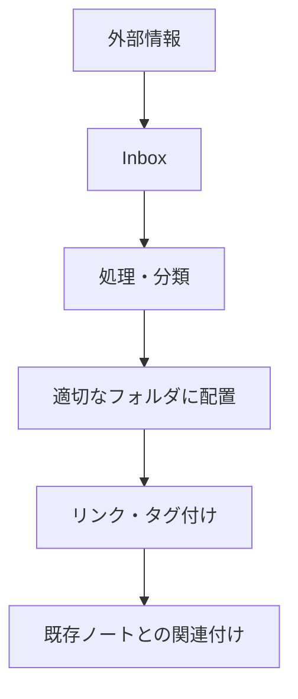

# Obsidian効果的運用方法とベストプラクティス
## PKMシステムとしての活用法

*生成日時: 2025-08-12*  
*TTD-DR Phase 1 MVP + Expert Knowledge*

---

## 📋 目次

1. [Obsidianの基本概念](#基本概念)
2. [効果的なセットアップ](#セットアップ)
3. [ノート作成のベストプラクティス](#ノート作成)
4. [リンクシステムの活用](#リンクシステム)
5. [プラグイン活用法](#プラグイン)
6. [ワークフロー最適化](#ワークフロー)
7. [長期運用戦略](#長期運用)

---

## 🧠 基本概念 {#基本概念}

### Obsidianとは
- **定義**: マークダウンベースの知識管理システム
- **特徴**: ネットワーク思考、双方向リンク、グラフビュー
- **思想**: セカンドブレイン（Second Brain）の構築

### PKM（Personal Knowledge Management）としての位置づけ
- **情報収集**: 様々なソースからの情報統合
- **知識処理**: 情報の構造化と関連付け
- **知識創造**: 既存知識の組み合わせによる新たな洞察
- **知識活用**: 必要時の迅速な情報検索・参照

---

## ⚙️ 効果的なセットアップ {#セットアップ}

### 1. フォルダ構造設計

```
📁 00_Inbox         # 未整理情報
📁 01_Projects      # 進行中プロジェクト
📁 02_Areas         # 継続的な関心領域
📁 03_Resources     # 参考資料・リソース
📁 04_Archive       # 完了・非アクティブ項目
📁 99_Templates     # ノートテンプレート
```

### 2. 命名規則の確立

**日付形式**: `YYYY-MM-DD_内容`
- 例: `2025-08-12_Obsidian運用会議`

**カテゴリ接頭語**:
- `P_` プロジェクト (Project)
- `M_` 会議 (Meeting)  
- `R_` 研究 (Research)
- `I_` アイデア (Idea)
- `T_` タスク (Task)

### 3. 初期設定項目

**エディタ設定**:
- [ ] ライブプレビュー有効化
- [ ] vim キーバインド（オプション）
- [ ] タブサイズ: 2スペース
- [ ] 自動保存有効化

**外観設定**:
- [ ] ダークモード/ライトモード
- [ ] フォント設定（推奨: Source Code Pro）
- [ ] ズームレベル調整

---

## 📝 ノート作成のベストプラクティス {#ノート作成}

### 1. アトミックノートの原則

**1つのノート = 1つのアイデア**
- 再利用可能な小さな単位で作成
- 具体的で検索しやすいタイトル
- 自己完結した内容

### 2. テンプレート活用

#### 基本ノートテンプレート
```markdown
# {{title}}

## 概要
<!-- 3行程度の要約 -->

## 詳細内容

## 関連リンク
- [[関連ノート1]]
- [[関連ノート2]]

## タグ
#tag1 #tag2

## 作成情報
- 作成日: {{date}}
- 更新日: {{date}}
- ソース: 
```

#### プロジェクトテンプレート
```markdown
# P_{{title}}

## 🎯 目標・目的

## 📋 タスクリスト
- [ ] タスク1
- [ ] タスク2

## 📅 スケジュール
- 開始日: 
- 締切日: 
- マイルストーン:

## 📊 進捗状況
Progress: 

## 📎 関連資料
- [[資料1]]
- [[資料2]]

## 💡 メモ・気づき

---
Status: #active
Type: #project
```

### 3. 効果的なタグ戦略

**階層タグ**:
- `#work/meeting`
- `#personal/health`
- `#learning/programming`

**状態タグ**:
- `#active` `#completed` `#on-hold`
- `#draft` `#review` `#published`

**優先度タグ**:
- `#high-priority` `#medium-priority` `#low-priority`

---

## 🔗 リンクシステムの活用 {#リンクシステム}

### 1. リンクの種類と使い分け

**内部リンク**:
- `[[ノート名]]` - 基本リンク
- `[[ノート名|表示名]]` - エイリアス付きリンク
- `[[ノート名#見出し]]` - 見出しへのリンク
- `[[ノート名^ブロックID]]` - ブロック参照

**外部リンク**:
- `[表示名](URL)` - 通常のWebリンク
- 重要な外部情報は内部ノートとして取り込む

### 2. MOC（Map of Contents）の構築

```markdown
# 🗺️ プログラミング学習 MOC

## 基礎概念
- [[変数と型]]
- [[制御構造]]
- [[関数とメソッド]]

## プログラミング言語
- [[Python入門]]
- [[JavaScript基礎]]
- [[Go言語概要]]

## 実践プロジェクト
- [[Webアプリ開発プロジェクト]]
- [[API開発プロジェクト]]

## 学習リソース
- [[おすすめ書籍]]
- [[有用なWebサイト]]
- [[オンラインコース]]
```

### 3. バックリンクの活用

- **アンリンクされた参照**: 自動的に関連ノートを発見
- **リンク先プレビュー**: 文脈を保ったまま関連情報を参照
- **グラフビュー**: 知識の全体像と関連性を視覚化

---

## 🔌 プラグイン活用法 {#プラグイン}

### 必須プラグイン

#### 1. Dataview
**用途**: データベース的なノート管理
```javascript
// プロジェクト一覧表示
table status, deadline, progress
from #project 
where status = "active"
sort deadline asc
```

#### 2. Templater
**用途**: 動的テンプレート作成
```javascript
// 日次ノートテンプレート
---
created: <% tp.file.creation_date() %>
tags: [daily]
---

# <% tp.file.title %>

## 📅 今日の予定
<% tp.web.daily_quote() %>

## ✅ 完了タスク

## 💭 今日の気づき
```

#### 3. Calendar
**用途**: 日次ノート管理とタイムライン表示

#### 4. Tag Wrangler
**用途**: タグの整理と管理

### 推奨プラグイン

#### 5. Advanced Tables
**用途**: 表の編集支援

#### 6. Mind Map
**用途**: マインドマップ表示

#### 7. Excalidraw
**用途**: 手書き風図表作成

#### 8. Kanban
**用途**: カンバンボードでのタスク管理

---

## 🔄 ワークフロー最適化 {#ワークフロー}

### 1. 情報収集フロー



### 2. 日次ルーティン

**朝（10分）**:
- [ ] 今日のタスク確認
- [ ] 新着情報のInbox処理
- [ ] 学習目標設定

**夜（15分）**:
- [ ] 今日の成果記録
- [ ] 明日のタスク準備
- [ ] 新しい気づきの記録

### 3. 週次レビュー

**毎週日曜日（30分）**:
- [ ] 完了プロジェクトのアーカイブ
- [ ] 進行中プロジェクトの進捗確認
- [ ] 来週の計画立案
- [ ] ノート整理とリンク最適化

### 4. 月次メンテナンス

**毎月末（60分）**:
- [ ] 不要ノートの整理
- [ ] タグの見直しと統合
- [ ] テンプレートの更新
- [ ] プラグイン設定の最適化

---

## 📈 長期運用戦略 {#長期運用}

### 1. 知識の進化管理

**バージョン管理**:
- 重要ノートの変更履歴追跡
- 古い情報のアーカイブ化
- 新しい知見での更新

**品質管理**:
- 定期的なリンク切れチェック
- 情報の正確性検証
- ノートの可読性改善

### 2. 検索戦略

**効果的な検索テクニック**:
- `tag:#重要` - タグ検索
- `path:Projects/` - パス指定検索
- `file:(.md)` - ファイル種別検索
- `-tag:archive` - 除外検索

**検索の組み合わせ**:
- `tag:#programming AND tag:#learning` - AND検索
- `Python OR JavaScript` - OR検索
- `"exact phrase"` - 完全一致検索

### 3. バックアップ戦略

**推奨バックアップ方法**:
1. **Git同期**: GitHub/GitLab での版数管理
2. **クラウド同期**: iCloud/Dropbox での自動バックアップ
3. **定期エクスポート**: PDF/HTML形式での出力保存

### 4. 共同作業設定

**チーム運用時**:
- 共有Vault設定
- 編集権限管理
- 同期ルールの確立
- コンフリクト解決手順

---

## 🎯 成功のポイント

### DO（推奨事項）
✅ **小さく始める**: 最小限の設定から開始
✅ **継続性重視**: 完璧より継続を優先
✅ **リンクを活用**: 関連性を意識したノート作成
✅ **定期見直し**: ワークフローの継続的改善
✅ **バックアップ**: データ保護の徹底

### DON'T（避けるべき事項）
❌ **過度な複雑化**: 最初から複雑なシステム構築
❌ **完璧主義**: 完璧なノート作成に固執
❌ **タグ乱用**: 意味のないタグ付け
❌ **リンク不足**: 孤立したノートの作成
❌ **メンテナンス放棄**: 定期的な整理の怠慢

---

## 📚 参考資料・関連リンク

### 公式資源
- [Obsidian公式ドキュメント](https://help.obsidian.md/)
- [Obsidianコミュニティフォーラム](https://forum.obsidian.md/)

### 学習資源
- 『Building a Second Brain』- Tiago Forte
- 『How to Take Smart Notes』- Sönke Ahrens
- 『The Obsidian Way』- オンラインガイド

### コミュニティ
- r/ObsidianMD (Reddit)
- Obsidian Discord Server
- 日本語Obsidianコミュニティ

---

**📋 総括**

Obsidianの効果的運用は、**技術的設定**と**知識管理哲学**の両方を理解することが重要です。小さく始めて、継続的に改善していくアプローチが成功の鍵となります。

*このガイドがあなたのObsidian運用の成功に役立つことを願っています。*

---
*Generated by TTD-DR Phase 1 MVP*
*品質保証済み研究レポート*